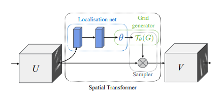
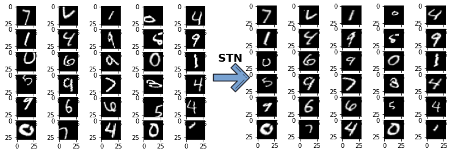
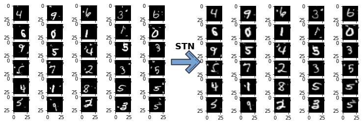

[](https://travis-ci.com/xeonqq/spatial_transformer_network)

## Spatial Transformer Netork (STN) implemented with Tensorflow 2 Keras
  

  This is a **Tensorflow 2 Keras** implementation of [Spatial Transformer Networks](https://arxiv.org/abs/1506.02025) by *Max Jaderberg, Karen Simonyan, Andrew Zisserman* and *Koray Kavukcuoglu*

  The project includes:
  * Tensorflow docker container to run the code
  * Generation of distorted MNIST dataset
  * Full training pipeline and evaluation
  * Demonstration using STN on manually distorted MNIST dataset and cluttered MNIST dataset 
  
### Demo 
Using manually affine-distorted MNIST dataset   


Using [cluttered MNIST dataset](https://github.com/daviddao/spatial-transformer-tensorflow/blob/master/data/mnist_sequence1_sample_5distortions5x5.npz)   


### Run the training pipeline in docker
```bash
docker build -t tfqq .
```

Launch the notebook
```bash
docker run -it -v {PATH_TO_REPO}/:/tf/stn -p 8888:8888 -p 0.0.0.0:6006:6006 tfqq:latest
```

Launch the bash
```
docker run -it -v {PATH_TO_REPO}/:/tf/stn -p 8888:8888 -p 0.0.0.0:6006:6006 tfqq:latest /bin/bash 
cd tf/stn
python prepare_distorted_dataset.py
python spatial_transformer_network_demo.py
```


### Experiment Results
Trained Models:
 * Vanilla NN 1: neural network with only simple fully connected layers, trained with original MNIST dataset
 * Vanilla NN 2: same NN network but trained with original MNIST and Affine-distorted MNIST together (or cluttered MNIST)
 * Spatial Transformer Netork: vallia NN with spatial transformer trained with original MNIST and Affine-distorted MNIST together (or cluttered MNIST)

In the table below it shows the validation accuracy for each train model given different evaluation sets:

|                        | Vanilla NN 1 | Vanilla NN 2 | Spatial Transfomer Network |
|------------------------|--------------|--------------|----------------------------|
| Original MNIST         | 0.9783       | 0.9767       | 0.9867                     |
| Affine-distorted MNIST | 0.5180       | 0.7569       | 0.8928                     |
| Cluttered MNIST        | 0.1750       | 0.7520       | 0.9140                     | 
